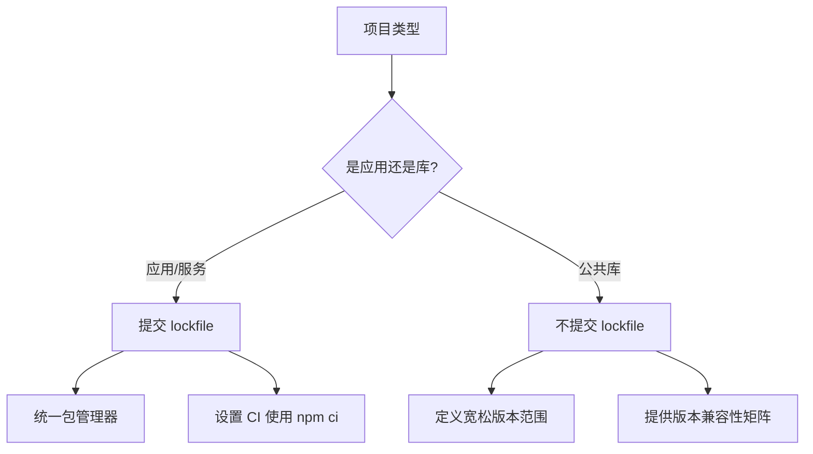

---
title: "关于 package lock json 是否应该提交到 Git 仓库"
date: 2025-11-14T08:22:46+08:00
draft: false
categories: ["DevOps"]
---

关于 `package-lock.json` 是否应该提交到 Git 仓库，以下是经过验证的行业实践和技术分析：

---

### **主流技术社区的共识**
| 项目类型       | 推荐做法                  | 代表案例                     |
|----------------|--------------------------|----------------------------|
| **前端应用**   | ✅ 必须提交               | Next.js、Create-React-App  |
| **Node 服务**  | ✅ 必须提交               | Express、NestJS            |
| **开源库**     | ⚠️ 不提交（特殊情况除外） | React、Vue、Lodash         |
| **Monorepo**   | ✅ 必须提交               | Nx、Turborepo             |

---

### **技术原理深度解析**
1. **锁文件的作用**  
   `package-lock.json` 记录**精确的依赖树结构**，包括：
   - 每个依赖的完整版本号 (e.g. `1.2.3` 而非 `^1.2.0`)
   - 依赖的下载地址 (resolved URL)
   - 完整性校验码 (integrity hash)
   - 嵌套依赖的拓扑结构

2. **npm/yarn/pnpm 的差异**  
   | 包管理器 | 锁文件名           | 是否必须提交 |
   |----------|-------------------|-------------|
   | npm      | `package-lock.json` | ✅          |
   | yarn v1  | `yarn.lock`         | ✅          |
   | pnpm     | `pnpm-lock.yaml`    | ✅          |

---

### **必须提交的场景（应用类项目）**
1. **确保环境一致性**  
   ```bash
   # 没有 lockfile 时的风险示例
   $ npm install lodash@^4.17.0  # 实际可能安装 4.17.21 或 4.17.30
   ```

2. **CI/CD 可靠性保障**  
   在持续集成中必须使用：
   ```yaml
   # GitHub Actions 最佳实践
   - name: Install dependencies
     run: npm ci  # 依赖 lockfile 的安装方式
   ```

3. **安全审计的基准**  
   ```bash
   $ npm audit  # 审计结果基于 lockfile 的依赖树
   ```

---

### **不应提交的场景（库类项目）**
1. **语义化版本控制原则**  
   当你的库被其他项目依赖时：
   ```json
   {
     "dependencies": {
       "your-lib": "^1.0.0"  # 应允许自动获取 minor/patch 更新
     }
   }
   ```

2. **避免版本锁定冲突**  
   示例问题场景：
   ```
   你的库锁定 react@17.0.2
   用户项目锁定 react@18.2.0
   → 导致重复安装多个 React 副本
   ```

3. **知名库的实践参考**  
   ```bash
   # 查看 React 项目的 .gitignore
   $ curl -s https://raw.githubusercontent.com/facebook/react/main/.gitignore | grep lock
   yarn.lock
   ```

---

### **争议解决方案**
#### 场景：团队混合使用不同包管理器
**解决方案**：
1. 在 `package.json` 中添加引擎限制：
   ```json
   {
     "engines": {
       "npm": ">=8.0.0",
       "node": ">=16.0.0"
     }
   }
   ```
2. 使用 `preinstall` 脚本强制包管理器：
   ```json
   {
     "scripts": {
       "preinstall": "npx only-allow npm"
     }
   }
   ```

#### 场景：需要更新依赖
**正确工作流**：
```bash
# 1. 更新指定包
$ npm update lodash

# 2. 全量更新
$ npm update --save

# 3. 更新后测试并提交新 lockfile
$ git add package-lock.json
$ git commit -m "chore(deps): update lodash to 4.17.32"
```

---

### **性能优化建议**
1. **清理历史大文件**（如果已误提交）：
   ```bash
   # 使用 BFG 工具清理
   $ java -jar bfg.jar --delete-files package-lock.json --no-blob-protection .
   ```

2. **优化.gitattributes**：
   ```gitattributes
   # 对 lockfile 禁用 diff
   package-lock.json binary
   yarn.lock binary
   pnpm-lock.yaml binary
   ```

---

### **最终决策指南**


**总结建议**：
- **90% 的前端项目应该提交 lockfile**
- 仅在开发公共库且需要保持最大兼容性时例外
- 使用 `npm ci` 替代 `npm install` 以提高安装可靠性

