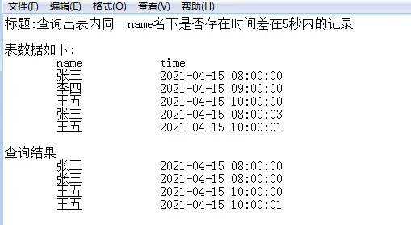

---
title: "Mysql 查询同一名字下时间差小于 5 秒的记录"
date: 2025-11-14T08:22:46+08:00
draft: false
categories: ["Mysql"]
tags: ["mysql", "sql", "查询优化", "时间差查询", "分组查询"]
---

### 题目如下



#### SQL 数据样本

```sql

DROP TABLE IF EXISTS `user`;
CREATE TABLE `user`  (
  `id` int(11) NOT NULL AUTO_INCREMENT COMMENT '主键',
  `name` varchar(255) CHARACTER SET utf8mb4 COLLATE utf8mb4_general_ci NOT NULL COMMENT '名字',
  `time` datetime(0) NOT NULL COMMENT '时间',
  PRIMARY KEY (`id`) USING BTREE
) ENGINE = InnoDB AUTO_INCREMENT = 106 CHARACTER SET = utf8mb4 COLLATE = utf8mb4_general_ci ROW_FORMAT = Dynamic;

-- ----------------------------
-- Records of user
-- ----------------------------
INSERT INTO `user` VALUES (2, '张三', '2021-04-19 00:00:00');
INSERT INTO `user` VALUES (6, '李四', '2021-04-19 01:00:00');
INSERT INTO `user` VALUES (10, '王五', '2021-04-19 02:00:00');
INSERT INTO `user` VALUES (15, '张三', '2021-04-19 00:00:02');
INSERT INTO `user` VALUES (19, '王五', '2021-04-19 02:00:04');
INSERT INTO `user` VALUES (20, '李四', '2021-04-19 03:00:20');
INSERT INTO `user` VALUES (100, '张三', '2021-04-01 00:00:00');
INSERT INTO `user` VALUES (101, '李四', '2021-04-17 11:00:00');
INSERT INTO `user` VALUES (102, '王五', '2021-04-14 19:00:00');
INSERT INTO `user` VALUES (103, '张三', '2021-04-05 02:29:02');
INSERT INTO `user` VALUES (104, '王五', '2021-04-10 11:45:31');
INSERT INTO `user` VALUES (105, '李四', '2021-04-08 20:14:48');

```

#### Mysql 5.7 解题参考：

```sql
SELECT
	u.`id`, u.`name`, u.`time`
FROM (
	SELECT
		*,
		TIMESTAMPDIFF(SECOND, `time`, `time1`) as delta1,
		TIMESTAMPDIFF(SECOND, `time`, `time2`) as delta2
	FROM (
			SELECT 
				(@r := @r + 1) r, user.`id`, user.`name`, user.`time`
			FROM
			    (SELECT @r := 0) AS t, user
			ORDER BY user.`name`, user.`time`

		) AS b LEFT JOIN (

			SELECT 
				(@r1 := @r1 + 1) r1, user.`name` as name1, user.`time` as time1
			FROM
			    (SELECT @r1 := -1) AS t1, user
			ORDER BY name1, time1

		) AS b1 ON b1.r1 = b.r AND b1.`name1` = b.name LEFT JOIN (

			SELECT 
				(@r2 := @r2 + 1) r2, user.`name` as name2, user.`time` as time2
			FROM
			    (SELECT @r2 := 1) AS t2, user
			ORDER BY name2, time2

		) AS b2 ON b2.r2 = b.r AND b2.`name2` = b.name 
	ORDER BY b.r ) AS u

WHERE 
	(u.delta1 <= 5 AND u.delta1 >= -5) OR (u.delta2 <= 5 AND u.delta2 >= -5)

```

#### Mysql 8.0 解题参考：

```sql
SELECT NAME , `time`
FROM (
	SELECT NAME, `time`,
		UNIX_TIMESTAMP(`time`) - UNIX_TIMESTAMP(pre_time) AS pre_delta,
		UNIX_TIMESTAMP(last_time) - UNIX_TIMESTAMP(`time`) AS last_delta
    FROM ( 
        SELECT NAME, `time`,
			lag(`time`, 1) over (PARTITION BY NAME ORDER BY `time`) AS pre_time,
			lead(`time`, 1) over (PARTITION BY NAME ORDER BY `time` ) AS last_time
        FROM `user` ) t) t
WHERE pre_delta <= 5 OR last_delta <= 5

```

#### 原理


